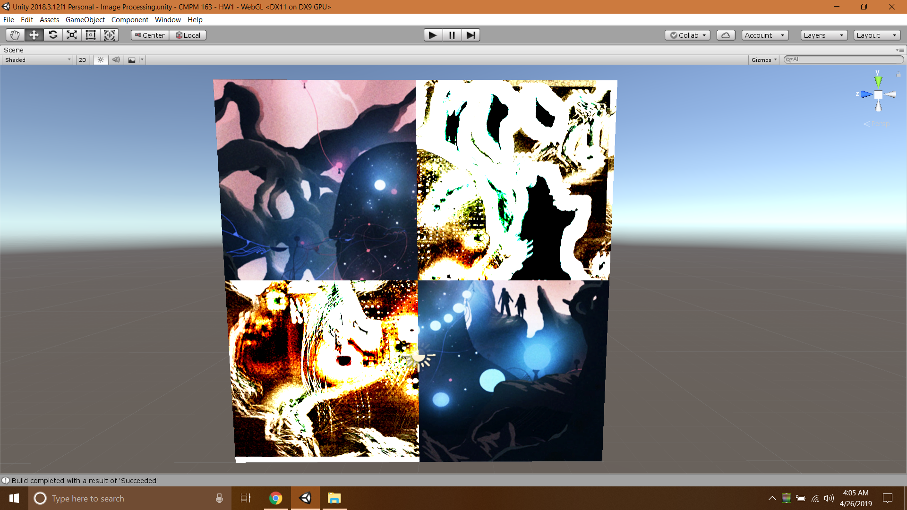

# CMPM163-HW1B
Image Processing

https://xbradley.github.io/CMPM163-HW1B/

# Controls
Mouse X = Look Up Distance  
Mouse Y = Mix  
Up/Down Arrows = Number of cells  
Left/Right Arrows = Cycle Between Patterns  

# ScreenShot

